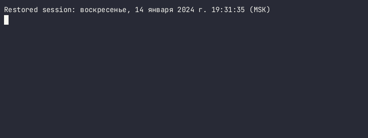

## First project in the He\}\{let school on python developer course.
[](https://github.com/ross0maha/python-project-49/actions)
[](https://codeclimate.com/github/ross0maha/python-project-49/maintainability)

<div class="embed-responsive embed-responsive-16by9">
<iframe src="./src/animated-text/dist/text2.html" height="200px" width="900px"></iframe>
</div>


[![]](./src/animated-text/dist/text2.html)


```
                 ____            _              ____                           
                | __ ) _ __ __ _(_)_ __        / ___| __ _ _ __ ___   ___  ___ 
                |  _ \| '__/ _` | | '_ \ _____| |  _ / _` | '_ ` _ \ / _ \/ __|
                | |_) | | | (_| | | | | |_____| |_| | (_| | | | | | |  __/\__ \
                |____/|_|  \__,_|_|_| |_|      \____|\__,_|_| |_| |_|\___||___/

```

### Install :floppy_disk: :

- Enter in command line `git clone git@github.com:ross0maha/python-project-49.git` 
- Or `git clone https://github.com/ross0maha/python-project-49.git` if you don't use SSH keys.
- Type `make install`
- Type `make package-install`

:exclamation: **Make sure what in you $PATH variable exist you local home directory, like:**

- MacOS - ` /Users/[USER]/Library/Python/[Python VERSION]/bin/`
- Linux - `~/.local/lib/python3.11/site-packages`
- Windows - `C:\Users\[username]\AppData\Local\Programs\Python`

### Usage :warning: :

- 
- 
- 

### Uninstall :x: :

To uninstall packages type in commandline from project directory `make uninstall`

---

### Demo play.

#### Brain-Even game


#### Brain-Calc game


