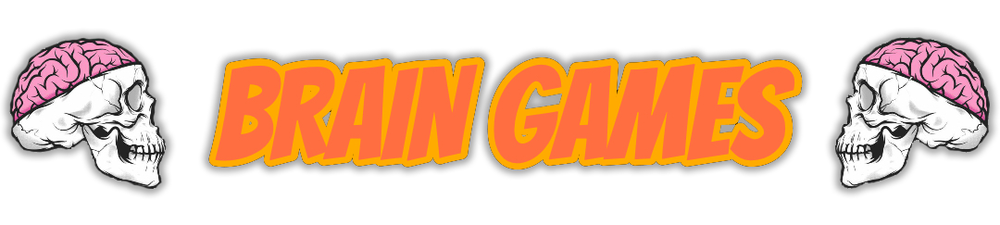

## First project in the He\}\{let school on python developer course.

### Install :floppy_disk: :

- Enter in command line `git clone git@github.com:ross0maha/python-project-49.git` 
- Or `git clone https://github.com/ross0maha/python-project-49.git` if you don't use SSH keys.
- Type `make install`
- Type `make package-install`

:exclamation: **Make sure what in you $PATH variable exist you local home directory, like:**

- MacOS - ` /Users/[USER]/Library/Python/[Python VERSION]/bin/`
- Linux - `~/.local/lib/python3.11/site-packages`
- Windows - `C:\Users\[username]\AppData\Local\Programs\Python`

### Usage :warning: :

- 
- 
- 

### Uninstall :x: :

To uninstall packages type in commandline from project directory `make uninstall`

---

### Demo play.

#### Brain-Even game

#### Brain-Calc game

